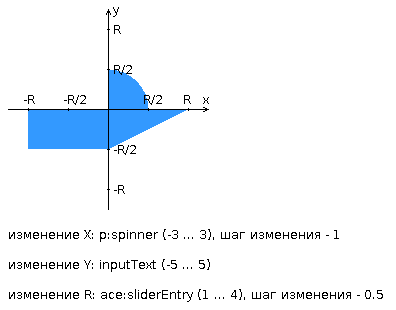

# Веб, лаб. 3
Повторное прохождение курса веб-программирования

**Вариант**: 141414

Разработать приложение на базе JavaServer Faces Framework, которое осуществляет проверку попадания точки в заданную область на координатной плоскости.

Приложение должно включать в себя 2 facelets-шаблона - стартовую страницу и основную страницу приложения, а также набор управляемых бинов (managed beans), реализующих логику на стороне сервера.

## Стартовая страница должна содержать следующие элементы:

- ✅ "Шапку", содержащую ФИО студента, номер группы и номер варианта.
- ✅ Интерактивные часы, показывающие текущие дату и время, обновляющиеся раз в 8 секунд.
- ✅ Ссылку, позволяющую перейти на основную страницу приложения.

## Основная страница приложения должна содержать следующие элементы:
- ✅ Набор компонентов для задания координат точки и радиуса области в соответствии с вариантом задания. Может потребоваться использование дополнительных библиотек компонентов - ICEfaces (префикс "ace") и PrimeFaces (префикс "p"). Если компонент допускает ввод заведомо некорректных данных (таких, например, как буквы в координатах точки или отрицательный радиус), то приложение должно осуществлять их валидацию.
- ✅ Динамически обновляемую картинку, изображающую область на координатной плоскости в соответствии с номером варианта и точки, координаты которых были заданы пользователем. Клик по картинке должен инициировать сценарий, осуществляющий определение координат новой точки и отправку их на сервер для проверки её попадания в область. Цвет точек должен зависить от факта попадания / непопадания в область. Смена радиуса также должна инициировать перерисовку картинки.
- ✅ Таблицу со списком результатов предыдущих проверок.
- ✅ Ссылку, позволяющую вернуться на стартовую страницу.

## Дополнительные требования к приложению:
- ✅ Все результаты проверки должны сохраняться в базе данных под управлением СУБД Postgres.
- ✅ Для доступа к БД необходимо использовать протокол JDBC без каких-либо дополнительных библиотек.
- ✅ Для управления списком результатов должен использоваться Application-scoped Managed Bean.
- ✅ Конфигурация управляемых бинов должна быть задана с помощью параметров в конфигурационном файле.
- ✅ Правила навигации между страницами приложения должны быть заданы в отдельном конфигурационном файле.

## Доп. задание:
- ✅ Перевести график в 3D.
- ✅ Добавить возможность постановки точки в трехмерном пространстве.

## График


(ace-компоненты не совместимы с 29 версией WildFly из-за JakartaEE и просто рендериться не будут. Откатываться на 26 версию или младше и править код под Java EE - не оправданно долго, поэтому воспользуюсь аналогом из PrimeFaces)

## Сборка
**Локально**:


**Гелиос**:
1. Установить и распаковать WildFliy
2. Зайти в папку `/wildfly-34.0.0.Beta1/standalone/configuration`
3. `vim standalone.xml`
4. Найти группу свойств <socket-binding>, и для socket-binding с `name="http"` изменить номер порта на свой, а также для `name="management-http"` изменить номер порта на свой, отличный от того что указали в предыдущем сокете.
5. Сохранить файл, перейти в `/wildfly-34.0.0.Beta1/bin` и запустить `./add-user.sh` и добавляем юзера в Management
6. Запускаем `./standalone.sh`
7. Теперь на локалке нужно будет пробросить два порта, это те порты, которые мы указали перед этим в standalone.xml 
    ```bash
    ssh -L 28002:localhost:28002 -p 2222 s336423@se.ifmo.ru
    ssh -L 28003:localhost:28003 -p 2222 s336423@se.ifmo.ru
    ./standalone.sh # в папке bin в wildfly
    ```
8. Теперь заходим на адрес management-http (`http:localhost:336423`). Откроется окно с логином - туда вводим данные, которые указали в add-user и попадаем в панель управления вайлдфлаем
9. Жмем на Deployments и заливаем туда war-ник с лабой
10. После деплоя жмем на content-root и нас перекинет на сайт с лабой.

## Вопросы
- Технология JavaServer Faces. Особенности, отличия от сервлетов и JSP, преимущества и недостатки. Структура JSF-приложения.
- Использование JSP-страниц и Facelets-шаблонов в JSF-приложениях.
- JSF-компоненты - особенности реализации, иерархия классов. Дополнительные библиотеки компонентов. Модель обработки событий в JSF-приложениях.
- Конвертеры и валидаторы данных.
- Представление страницы JSF на стороне сервера. Класс UIViewRoot.
- Управляемые бины - назначение, способы конфигурации. Контекст управляемых бинов.
- Конфигурация JSF-приложений. Файл faces-config.xml. Класс FacesServlet.
- Навигация в JSF-приложениях.
- Доступ к БД из Java-приложений. Протокол JDBC, формирование запросов, работа с драйверами СУБД.
- Концепция ORM. Библиотеки ORM в приложениях на Java. Основные API. Интеграция ORM-провайдеров с драйверами JDBC.
- Библиотеки ORM Hibernate и EclipseLink. Особенности, API, сходства и отличия.
- Технология JPA. Особенности, API, интеграция с ORM-провайдерами.